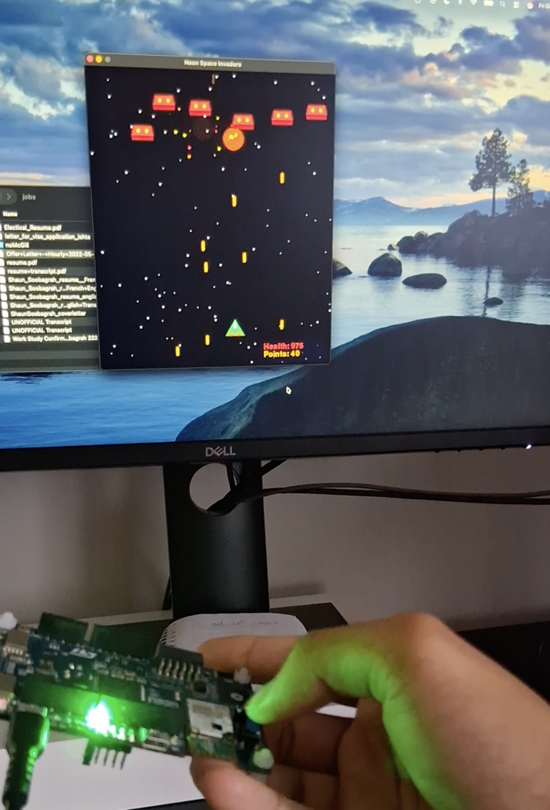

# Wireless Embedded Game Controller: Neon Space Invaders

This repository contains the source code for a low-latency, wireless gaming system featuring a custom **STM32-based hardware controller** and a **Python-based Space Invaders** game. The project demonstrates the integration of embedded sensor data acquisition, direct memory access (DMA) optimization, and Bluetooth Low Energy (BLE) communication.

[](assets/SpaceInvader.mp4)

---

## 🚀 Project Overview

The system is split into two core components:
1.  **Hardware Controller (C / STM32 HAL):** An ARM Cortex-M4 (STM32L475) firmware that reads physical tilt via an onboard accelerometer and button presses, transmitting them as control commands.
2.  **Host Game Engine (Python):** An asynchronous Pygame application that receives real-time BLE notifications to control the player ship in a arcade shooter.

## ✨ Key Features

* **Real-Time Game Engine**: A fully functional "Neon Space Invaders" game built in Python using Pygame, featuring real-time player motion, dynamic difficulty scaling, particle-based explosions, and collision detection.
* **DMA-Optimized Sensor Polling**: Configured I2C with DMA to continuously retrieve LSM6DSL accelerometer data with minimal CPU overhead, allowing for non-blocking embedded operations.
* **Interrupt-Driven Inputs**: Utilizes GPIO External Interrupts (EXTI) for the firing button to ensure zero missed inputs and immediate response times.
* **Low-Latency BLE Protocol**: Implemented a custom BlueNRG Bluetooth wireless communication protocol to wirelessly transmit tilt controls to the PC.
* **Asynchronous Host Communication**: The Python host utilizes `asyncio` and `Bleak` to handle concurrent BLE notifications without interrupting the 60 FPS game loop.

---

## 🛠 Technical Architecture

### 1. Embedded Firmware (`main.c`)
* **Microcontroller:** STM32L475 (IoT Node)
* **Sensors:** LSM6DSL 6-axis IMU (using the X-axis for horizontal tilt).
* **Bluetooth Stack:** BlueNRG-MS SPI interface. Acts as a BLE Peripheral broadcasting a custom GATT Service (`0x1234`) and Characteristic (`0x5678`).
* **Control Flow:** The `space_invader_controller_non_blocking()` routine ensures the main loop never blocks. The accelerometer is polled every 50ms via DMA, and button presses queue pending shots via hardware interrupts.

### 2. Game Client (`SpaceInvader.py`)
* **Graphics Engine:** Pygame.
* **BLE Client:** `Bleak` library wrapped in an `asyncio` event loop.
* **Data Decoding:** Listens for 1-byte payloads (`0`: Stop, `1`: Left, `2`: Right, `3`: Fire) and updates a global state object instantly read by the game physics engine.

---

## 💻 Setup & Installation

### Hardware Flashing (STM32)
1. Open the project in STM32CubeIDE.
2. Ensure the BlueNRG and LSM6DSL drivers are properly linked in your workspace.
3. Build the project and flash it to the STM32L475 board.
4. Once running, the board will begin advertising as `MyApp`.

### Software Environment (Python)
Requires Python 3.7+ and a system with Bluetooth hardware enabled.

1. Install the required dependencies:
   ```bash
   pip install pygame bleak asyncio
   ```

2. Update the DEVICE_ADDRESS in SpaceInvader.py with your STM32's specific MAC address.

3. Run the game: python SpaceInvader.py

🎮 How to Play

1. Move Left: Tilt the STM32 board to the left.

2. Move Right: Tilt the STM32 board to the right.

3. Shoot: Press the onboard user button.

Exit: Press ESC on the keyboard to quit the game gracefully.
